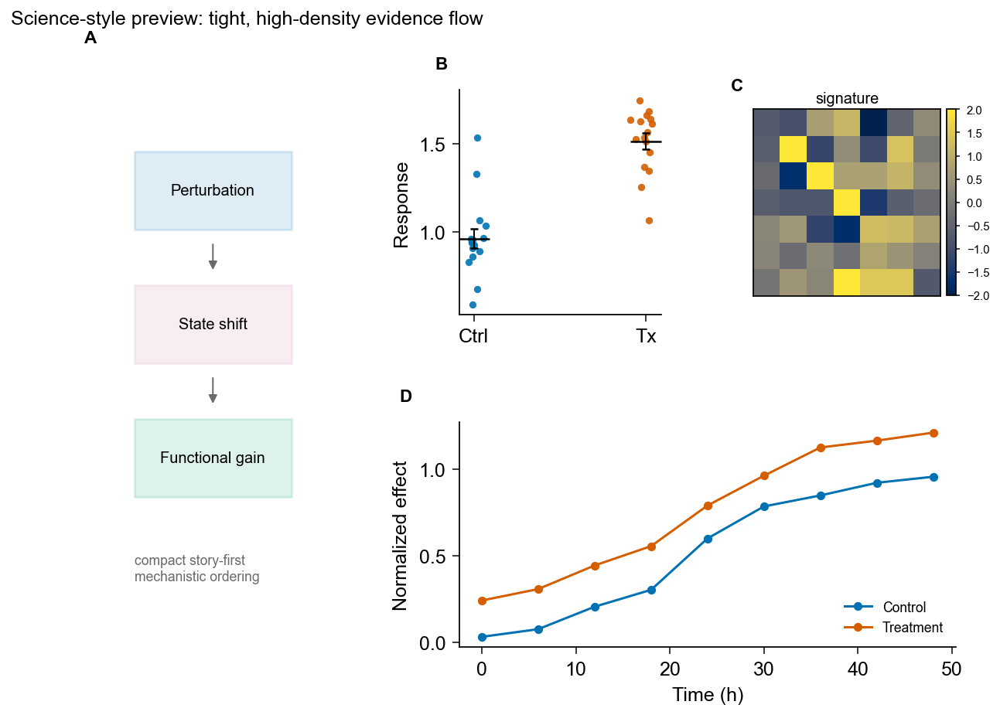
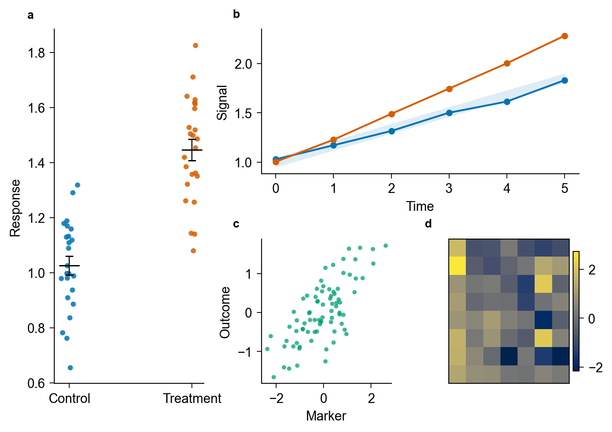
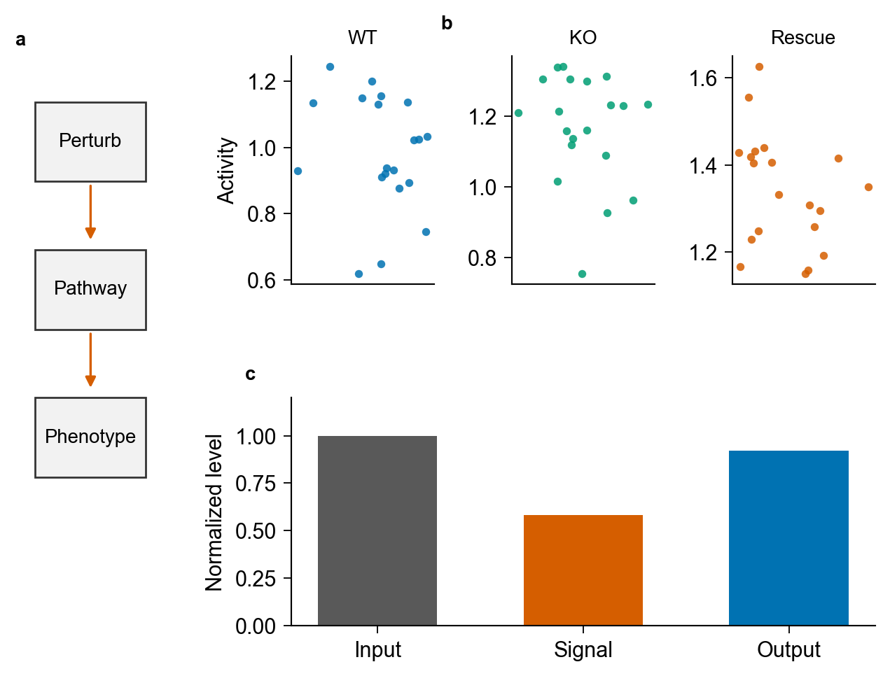
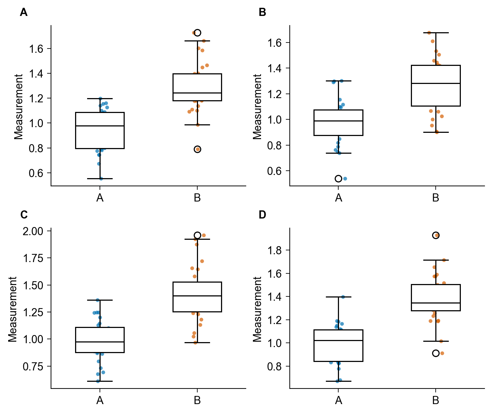
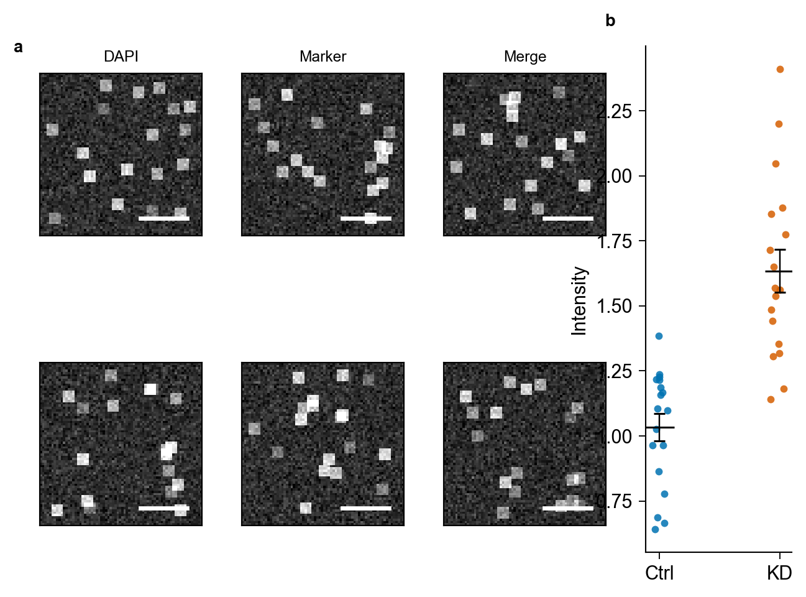
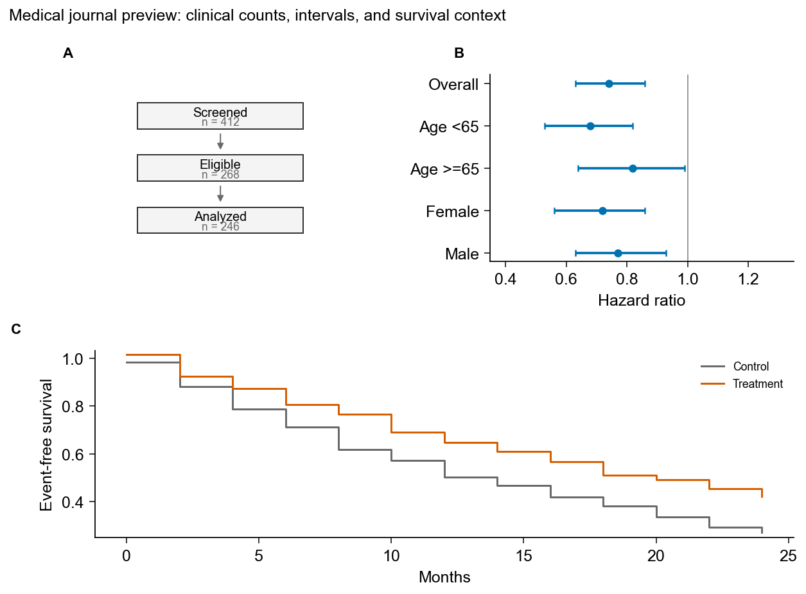
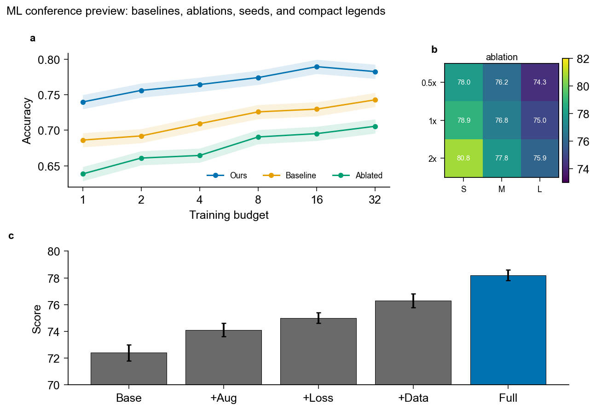

# Journal Figure Studio

[中文](#中文) | [English](#english)



## 中文

Journal Figure Studio 是一个用于科研论文配图的 Codex skill。它帮助模型把数据、草图、显微图、已有 figure 或审稿意见，整理成更接近投稿标准的多面板 scientific figure，并输出可复现脚本、可编辑文件和可执行验证的 QA 检查报告。

它的核心不是“套个好看的模板”，而是让模型先理解 figure 的科学论证：

```text
目标期刊风格 x 图型类型 x 证据意图
-> panel-level contract
-> Python 绘图/导出
-> 自动 QA + 人工投稿风险复核
```

### 它能做什么

- 从 CSV、Excel、统计结果、图片或已有 figure 出发，生成论文级多面板 figure。
- 按 Nature、Science-style、Cell/Cell Press、PLOS、JCB、Elsevier、IEEE、ACS、医学期刊、ML conference 等风格组织版式。
- 支持 dot plot、bar/grouped bar、box/violin、line/timecourse、scatter/correlation、heatmap、UMAP/t-SNE、forest plot、Kaplan-Meier、benchmark/ablation、schematic、microscopy/image plate + quantification 等常见图型。
- 默认使用 Python-first 工作流，生成可复现 `plot_script.py`、`plot_config`、`panel_contract` 和 `figure_qa.md`。
- 导出 SVG/PDF/PNG/TIFF 等投稿常用格式，并尽量保持 SVG/PDF 文字可编辑。
- 执行自动检查：contract 必填字段、SVG text node、PNG/TIFF 有效 dpi、实际字体、profile rule、source data 和 bundle 文件完整性。
- 继续保留人工 QA：统计标注、颜色可访问性、scale bar、image integrity、caption/source-data 风险。
- 审查已有 figure，输出 panel-by-panel 修改建议：保留、放大、合并、删除、移到扩展图或重画。

### 可执行验证

除了给模型提供作图策略，这个 skill 也内置脚本来生成和验证 figure bundle：

```bash
python3 journal-figure-studio/scripts/build_figure_bundle.py \
  --journal nature \
  --core-conclusion "Treatment increases the measured value." \
  --formats svg pdf png tiff
```

该命令会生成 `panel_contract.json`、`plot_config.json`、`plot_script.py`、`figure.svg`、`figure.pdf`、`figure.png`、`figure.tiff`、`figure_preview.png`、`figure_source_data.csv`、`figure_qa.md` 和 `bundle_manifest.json`。其中 `figure_qa.md` 会记录可执行检查结果，而不是只有待勾选清单。

### 风格预览

这些预览图是仓库内用脚本生成的示例展示图，用来说明该 skill 会引导模型关注的不同 journal-style 视觉倾向。它们不是投稿硬性规范，也不是科研证据图像。实际执行时，skill 主要读取 `journal-figure-studio/static/profiles/`、`archetypes/`、`intents/`、`overrides/` 和 `assets/templates/profile_rules.json` 里的规则；最终投稿仍应以目标期刊最新 author guide 为准。

| Science-style | Nature-style |
|---|---|
|  |  |

| Cell-style | PLOS-style |
|---|---|
|  |  |

| JCB-style | Medical journal |
|---|---|
|  |  |

| ML conference |
|---|
|  |

### 安装

最简单的方式：直接让 Codex 或 Claude 安装这个 skill。

```text
请从 git@github.com:panxiande/journal-figure-studio.git 安装 journal-figure-studio skill。
```

如果需要手动安装：

```bash
git clone git@github.com:panxiande/journal-figure-studio.git
mkdir -p "$HOME/.codex/skills"
cp -R journal-figure-studio/journal-figure-studio "$HOME/.codex/skills/"
```

重启 Codex 或开启新会话后即可使用。

### 使用示例

```text
用 journal-figure-studio 把这些 CSV 做成 Nature 风格 Fig. 2，多面板，输出 SVG/PDF/TIFF 和 QA 报告。
```

```text
帮我把这组显微图和定量结果整理成 JCB 风格 figure，检查 scale bar、source data 和 image integrity 风险。
```

```text
检查这张 PLOS 投稿图的分辨率、字体、统计标注、source data 和 caption 风险。
```

```text
用 journal-figure-studio 生成 Science-style 高信息密度多面板图，并跑自动 QA，输出完整 bundle。
```

### 项目结构

```text
.
├── README.md
├── docs/
│   └── previews/
└── journal-figure-studio/
    ├── SKILL.md
    ├── agents/
    ├── archetypes/
    ├── assets/
    ├── intents/
    ├── overrides/
    ├── references/
    ├── scripts/
    └── static/
```

可安装的 skill 本体是 `journal-figure-studio/` 子目录。

### 重要说明

- 该 skill 会区分 `required`、`recommended`、`style_observed` 和 `unknown_or_verify`，避免把“看起来像某期刊”误写成投稿硬性规范。
- 最终投稿前必须复核目标期刊最新 author guide。
- 不应使用生成式 AI 创造、修复、延展、擦除或改动科研证据图像；概念图和 graphical summary 应与证据图像明确区分。

## English

Journal Figure Studio is a Codex skill for publication-ready scientific figures. It helps an AI agent turn data, sketches, microscopy images, existing figures, or reviewer comments into manuscript-grade multipanel figures with reproducible scripts, editable exports, and executable QA reports.

It is not just a visual styling preset. The skill first frames the scientific argument:

```text
Journal profile x Plot archetype x Figure intent
-> panel-level contract
-> Python rendering/export
-> automated QA + human submission-risk review
```

### What It Can Do

- Create manuscript-level multipanel figures from CSV, Excel, statistical results, images, or existing figures.
- Organize figures in Nature, Science-style, Cell/Cell Press, PLOS, JCB, Elsevier, IEEE, ACS, medical journal, ML conference, or general publication styles.
- Support dot plots, bar/grouped bar, box/violin, line/timecourse, scatter/correlation, heatmaps, UMAP/t-SNE, forest plots, Kaplan-Meier curves, benchmark/ablation figures, schematics, and microscopy/image plate + quantification figures.
- Default to a Python-first workflow with reproducible `plot_script.py`, `plot_config`, `panel_contract`, and `figure_qa.md` outputs.
- Export SVG/PDF/PNG/TIFF and preserve editable text in SVG/PDF whenever possible.
- Run automated checks for contract fields, SVG text nodes, PNG/TIFF effective dpi, resolved fonts, profile rules, source data, and bundle completeness.
- Preserve human QA for statistical annotations, color accessibility, scale bars, image integrity, and caption/source-data risks.
- Audit existing figures and produce panel-by-panel revision plans.

### Executable Validation

This skill is not only a style guide. It includes scripts that generate and validate a figure bundle:

```bash
python3 journal-figure-studio/scripts/build_figure_bundle.py \
  --journal nature \
  --core-conclusion "Treatment increases the measured value." \
  --formats svg pdf png tiff
```

The command writes `panel_contract.json`, `plot_config.json`, `plot_script.py`, `figure.svg`, `figure.pdf`, `figure.png`, `figure.tiff`, `figure_preview.png`, `figure_source_data.csv`, `figure_qa.md`, and `bundle_manifest.json`. The QA report records executable checks instead of only a manual checklist.

### Style Previews

These preview images are script-generated repository examples showing the visual tendencies the skill asks the model to consider. They are not hard submission rules and are not scientific evidence images. During execution, the skill primarily uses the rule files in `journal-figure-studio/static/profiles/`, `archetypes/`, `intents/`, `overrides/`, and `assets/templates/profile_rules.json`. Final submission should always be checked against the latest official author guide for the target journal.

| Science-style | Nature-style |
|---|---|
|  |  |

| Cell-style | PLOS-style |
|---|---|
|  |  |

| JCB-style | Medical journal |
|---|---|
|  |  |

| ML conference |
|---|
|  |

### Install

The simplest path is to ask Codex or Claude to install the skill directly:

```text
Install the journal-figure-studio skill from git@github.com:panxiande/journal-figure-studio.git.
```

Manual install:

```bash
git clone git@github.com:panxiande/journal-figure-studio.git
mkdir -p "$HOME/.codex/skills"
cp -R journal-figure-studio/journal-figure-studio "$HOME/.codex/skills/"
```

Restart Codex or start a new session after installation.

### Example Prompts

```text
Use journal-figure-studio to make a Nature-style Fig. 2 from these CSV files, with SVG/PDF/TIFF exports and a QA report.
```

```text
Turn these microscopy images and quantification data into a JCB-style figure, checking scale bars, source data, and image integrity risks.
```

```text
Audit this PLOS submission figure for resolution, fonts, statistical annotations, source data, and caption risks.
```

```text
Use journal-figure-studio to create a Science-style high-density multipanel figure, run automated QA, and export a complete bundle.
```

### Repository Layout

```text
.
├── README.md
├── docs/
│   └── previews/
└── journal-figure-studio/
    ├── SKILL.md
    ├── agents/
    ├── archetypes/
    ├── assets/
    ├── intents/
    ├── overrides/
    ├── references/
    ├── scripts/
    └── static/
```

The installable skill is the nested `journal-figure-studio/` folder.

### Notes

- The skill separates `required`, `recommended`, `style_observed`, and `unknown_or_verify` rules, so visual style is not mistaken for official submission requirements.
- Always verify final submissions against the target journal's latest author guide.
- Do not use generative AI to create, repair, extend, erase, or alter scientific evidence images. Concept art and graphical summaries should be clearly separated from evidence panels.
